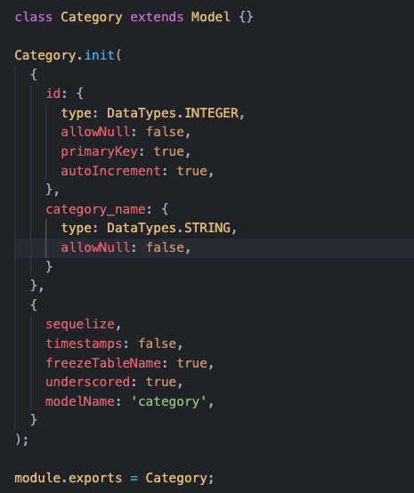
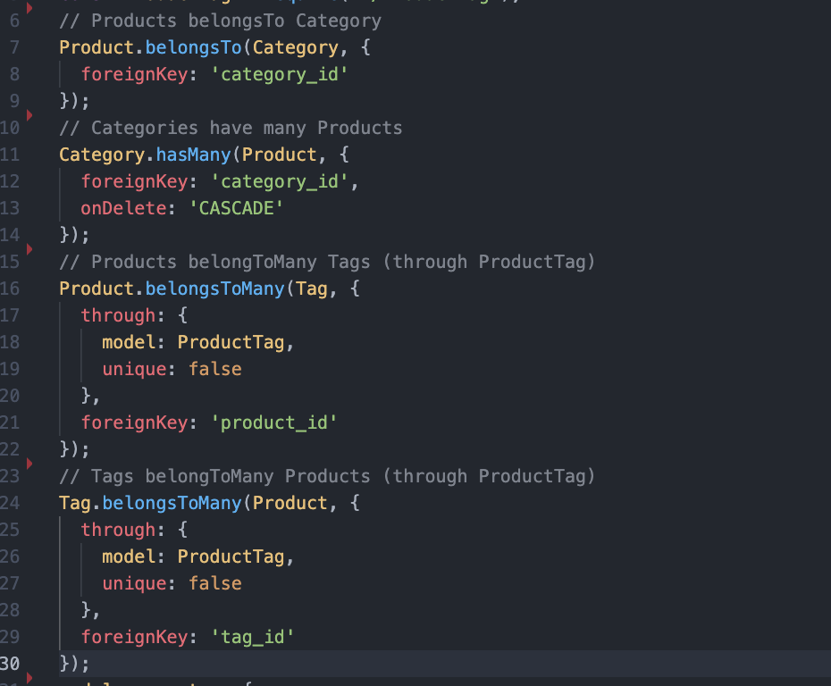
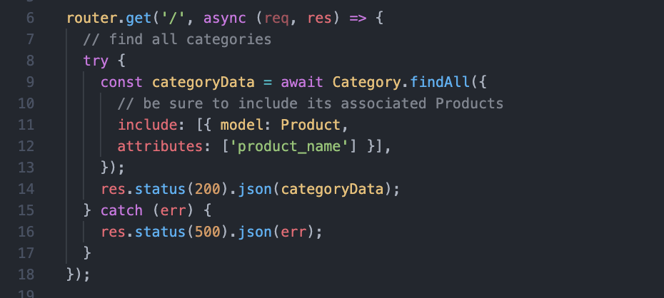

# HW13-E-Commerce-Back-End 
 
Deployed walkthrough video: [Tutorial Video](https://youtu.be/Gv8n74_lfe0)

## Description
This project focuses on building the backend for an e-commence site using Express.js, MySQL2, Sequelize, and dotenv.

## Table of Contents

- [Installation](#installation)
- [Usage](#usage)
- [License](#license)
- [Contributing](#contributing)
- [Tests](#tests)
- [Questions](#questions)

## Installation 
For the installation video and full walkthrough please view the gif below or, for larger viewing capabilities please visit my [YouTube Tutorial Video](https://youtu.be/Gv8n74_lfe0).   
## Usage
I created four model files for catergoies, products, product tags, and tags.   
Catergory model JS page:  
  
After building my Sequilize models I build the relationships.  
Index.js model page Relationships:  
  
I then wrote api routes to proform RESTful CRUD operations.  
Category GET route:  
  
## License
This project is covered under the MIT license. 

## Contributing
This project wouldn’t have been possible without the contributions credited in the links below. 
[Insomnia Webpage](https://insomnia.rest/)  
[Express Webpage](https://expressjs.com/) 
[Sequelize Webpage](https://sequelize.org/) 
## Tests
In the video I test my routes using GET, POST, PUT, and DELETE in Insomnia.  
For more testing opportunities please follow along closely to the video and adjust your code when needed.
## Questions
Please feel free to contact me with any questions or suggestions either on my GitHub account or via email.
* GitHub: https://github.com/taylor25et
* E-Mail: taylor25et@gmail.com
* Github Repo: https://github.com/Taylor25et/HW13-E-Commerce-Back-End
* Deployed Video: https://youtu.be/Gv8n74_lfe0

